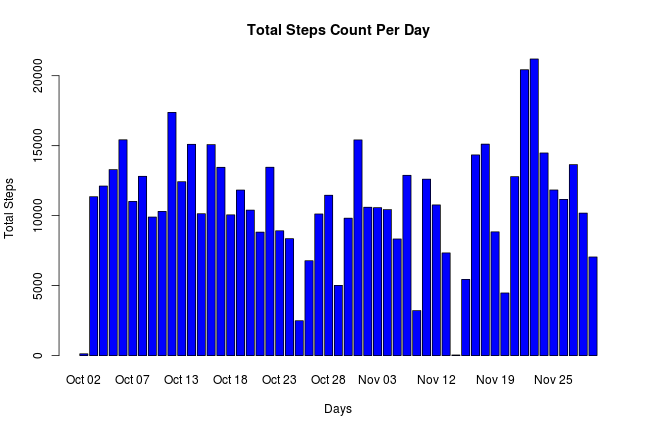
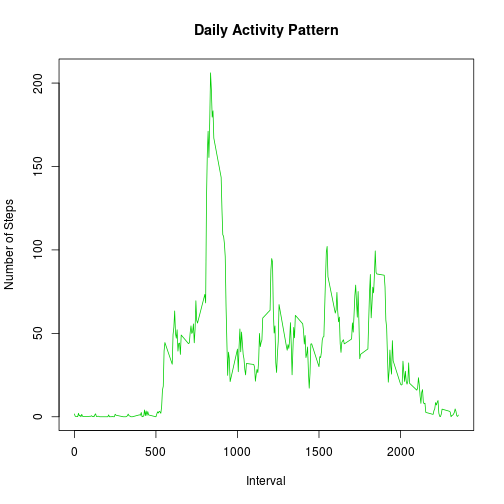
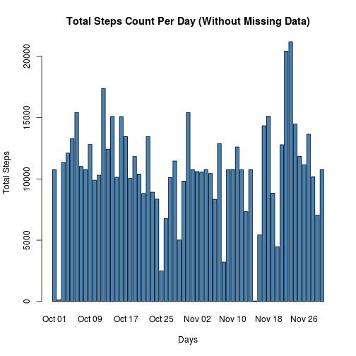
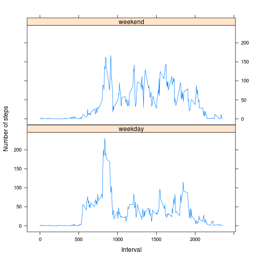

## Reproducible Research : Peer Assessment 1  
## Author : Abhishek Agrawal 
=========================================================

## Loading and preprocessing the data
1. Load the data (i.e. read.csv())
2. Process/transform the data (if necessary) into a format suitable for your analysis

```r
options(scipen = 1)
unzip("activity.zip")
activity <- read.csv("activity.csv", colClasses = c("integer", "Date", "character"))
activity$day <- factor(paste(substring(months(as.Date(activity$date)),0,3), 
                      substring(as.Date  (activity$date), 9), sep=" ")) 
tidyData <- na.omit(activity)
head(tidyData)
```

```
##     steps       date interval    day
## 289     0 2012-10-02        0 Oct 02
## 290     0 2012-10-02        5 Oct 02
## 291     0 2012-10-02       10 Oct 02
## 292     0 2012-10-02       15 Oct 02
## 293     0 2012-10-02       20 Oct 02
## 294     0 2012-10-02       25 Oct 02
```


## What is mean total number of steps taken per day?
1. Make a time series plot (i.e. type = "l") of the 5-minute interval (x-axis) and the average number of steps taken, averaged across all days (y-axis)
2. Which 5-minute interval, on average across all the days in the dataset, contains the maximum number of steps? 

```r
tot_steps <- aggregate(tidyData$steps, list(tidyData$date), FUN="sum")
names(tot_steps) <- c("date","total")
tot_steps$date <- factor(paste(substring(months(as.Date(tot_steps$date)),0,3), 
                      substring(as.Date  (tot_steps$date), 9), sep=" ")) 
barplot(tot_steps$total, names.arg=tot_steps$date, xlab="Days", ylab="Total Steps", main="Total Steps Count Per Day", col="blue")
```

 

```r
# Mean number of Steps Per Day

print(round(mean(tot_steps$total)))
```

```
## [1] 10766
```

```r
# Median number of Steps Per Day 
print(median(tot_steps$total))
```

```
## [1] 10765
```


## What is the average daily activity pattern?
1. Make a time series plot (i.e. type = "l") of the 5-minute interval (x-axis) and the average number of steps taken, averaged across all days (y-axis)

2. Which 5-minute interval, on average across all the days in the dataset, contains the maximum number of steps?

```r
activity_steps <- aggregate(tidyData$steps, list(as.numeric(tidyData$interval)), FUN="mean")
names(activity_steps) <- c("interval","mean")
plot(activity_steps, type="l", xlab="Interval", ylab="Number of Steps", main="Daily Activity Pattern", col=3)
```

 

```r
# Maximum Daily Average Steps 5-minute Interval 
maxI <- activity_steps[which.max(activity_steps$mean),]
print(maxI)
```

```
##     interval     mean
## 104      835 206.1698
```


## Imputing missing values
1. Calculate and report the total number of missing values in the dataset (i.e. the total number of rows with NAs)

2. Devise a strategy for filling in all of the missing values in the dataset. The strategy does not need to be sophisticated. For example, you could use the mean/median for that day, or the mean for that 5-minute interval, etc.

3. Create a new dataset that is equal to the original dataset but with the missing data filled in.

4. Make a histogram of the total number of steps taken each day and Calculate and report the mean and median total number of steps taken per day. Do these values differ from the estimates from the first part of the assignment? What is the impact of imputing missing data on the estimates of the total daily number of steps? 


```r
missingSteps <- which(is.na(activity))
print(length(missingSteps))
```

```
## [1] 2304
```

```r
# Missing values replaced by corresponding mean 5-minute internal steps
newData <- activity
for(i in 1:length(missingSteps)){
    newData[missingSteps[i], 1] <- activity_steps[activity_steps$interval ==
                                   newData[missingSteps[i],]$interval,]$mean
}

## Histogram of total Number of Steps per day
new_steps <- aggregate(newData$steps, list(newData$date), FUN="sum")
names(new_steps) <- c("date","total")
new_steps$date <- factor(paste(substring(months(as.Date(new_steps$date)),0,3), 
                      substring(as.Date  (new_steps$date), 9), sep=" ")) 
barplot(new_steps$total, names.arg=new_steps$date, xlab="Days", ylab="Total Steps",
        main="Total Steps Count Per Day (Without Missing Data)", col="steelblue")
```

 

```r
# Mean number of Steps Per Day

print(round(mean(new_steps$total)))
```

```
## [1] 10766
```

```r
# Median number of Steps Per Day 
print(median(new_steps$total))
```

```
## [1] 10766.19
```

```r
## Difference From TidyData Values
print(mean(new_steps$total) - mean(tot_steps$total))
```

```
## [1] 0
```

```r
print(median(new_steps$total) - median(tot_steps$total))
```

```
## [1] 1.188679
```
Hence after the new dataset creation, there is no difference in the mean value of total Steps.  But the median value of total number of steps per day has slighlty increased. 

## Are there differences in activity patterns between weekdays and weekends?
For this part the weekdays() function may be of some help here. Use the dataset with the filled-in missing values for this part.

1. Create a new factor variable in the dataset with two levels – “weekday” and “weekend” indicating whether a given date is a weekday or weekend day.

2. Make a panel plot containing a time series plot (i.e. type = "l") of the 5-minute interval (x-axis) and the average number of steps taken, averaged across all weekday days or weekend days (y-axis). See the README file in the GitHub repository to see an example of what this plot should look like using simulated data.

```r
head(newData)
```

```
##       steps       date interval    day
## 1 1.7169811 2012-10-01        0 Oct 01
## 2 0.3396226 2012-10-01        5 Oct 01
## 3 0.1320755 2012-10-01       10 Oct 01
## 4 0.1509434 2012-10-01       15 Oct 01
## 5 0.0754717 2012-10-01       20 Oct 01
## 6 2.0943396 2012-10-01       25 Oct 01
```

```r
newData$daysOfWeek <- factor(weekdays(newData$date))
levels(newData$daysOfWeek)
```

```
## [1] "Friday"    "Monday"    "Saturday"  "Sunday"    "Thursday"  "Tuesday"  
## [7] "Wednesday"
```

```r
levels(newData$daysOfWeek) <- list(weekday = c("Monday", "Tuesday", "Wednesday", 
                                               "Thursday", "Friday"),
                                   weekend = c("Saturday", "Sunday"))
table(newData$daysOfWeek)
```

```
## 
## weekday weekend 
##   12960    4608
```

```r
library(lattice)
meanSteps <- aggregate(newData$steps, list(as.numeric(newData$interval),newData$daysOfWeek),        FUN = "mean")
names(meanSteps) <- c("interval","weekDays", "avgSteps")
                      
xyplot(meanSteps$avgSteps ~ meanSteps$interval | meanSteps$weekDays, 
       layout = c(1, 2), type = "l", 
       xlab = "Interval", ylab = "Number of steps")
```

 
