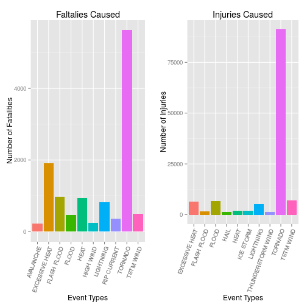
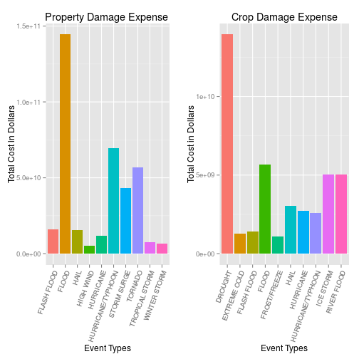

Topic : Weather Events Impacts on US Public Health and Economy
===============================================================

Synopsis
=================

In this document, a brief report is presented euclidating the damages of life and property due to various distratrous calamitic events both directly and indirectly. The Events and the damage data is captured by various resources. More detail of this data can be found here. For this analysis, the first step taken was understanding of data which can be done by reading the document link mention above. After that, feature selection and extraction were required as part of data pre-processing. Since the objective of this analysis was to analyze human health and property hazards, many features captured in the data were not necessary. Hence the features related to the analysis were extracted and transformed accordinly. After that based on the event types i.e. different disastrous events like Tornado, Cold Storm etc., the human injuries and fatalities were aggregated to show the impact of these events on human health. Similarly the property damage and crop damage expenses were aggregated to estimate the impact of economical loss due to these events.


Data Processing
======================

In this step, the raw data is being extracted and brief detail of its features are projected. Based on the features and analysis requirements, a subset of features are extracted. And in the last part, the total expense based on damage amount and approrimate figure has been calculated for property and crop damages. Unused features are then rejected.


```r
library(gridExtra)
```

```
## Loading required package: grid
```

```r
library(ggplot2)

stormData <- read.csv("repdata-data-StormData.csv") 
str(stormData)
```

```
## 'data.frame':	902297 obs. of  37 variables:
##  $ STATE__   : num  1 1 1 1 1 1 1 1 1 1 ...
##  $ BGN_DATE  : Factor w/ 16335 levels "1/1/1966 0:00:00",..: 6523 6523 4242 11116 2224 2224 2260 383 3980 3980 ...
##  $ BGN_TIME  : Factor w/ 3608 levels "000","0000","0001",..: 152 167 2645 1563 2524 3126 122 1563 3126 3126 ...
##  $ TIME_ZONE : Factor w/ 22 levels "ADT","AKS","AST",..: 6 6 6 6 6 6 6 6 6 6 ...
##  $ COUNTY    : num  97 3 57 89 43 77 9 123 125 57 ...
##  $ COUNTYNAME: Factor w/ 29601 levels "","5NM E OF MACKINAC BRIDGE TO PRESQUE ISLE LT MI",..: 13513 1873 4598 10592 4372 10094 1973 23873 24418 4598 ...
##  $ STATE     : Factor w/ 72 levels "AK","AL","AM",..: 2 2 2 2 2 2 2 2 2 2 ...
##  $ EVTYPE    : Factor w/ 985 levels "   HIGH SURF ADVISORY",..: 826 826 826 826 826 826 826 826 826 826 ...
##  $ BGN_RANGE : num  0 0 0 0 0 0 0 0 0 0 ...
##  $ BGN_AZI   : Factor w/ 35 levels "","  N"," NW",..: 1 1 1 1 1 1 1 1 1 1 ...
##  $ BGN_LOCATI: Factor w/ 54429 levels ""," Christiansburg",..: 1 1 1 1 1 1 1 1 1 1 ...
##  $ END_DATE  : Factor w/ 6663 levels "","1/1/1993 0:00:00",..: 1 1 1 1 1 1 1 1 1 1 ...
##  $ END_TIME  : Factor w/ 3647 levels ""," 0900CST",..: 1 1 1 1 1 1 1 1 1 1 ...
##  $ COUNTY_END: num  0 0 0 0 0 0 0 0 0 0 ...
##  $ COUNTYENDN: logi  NA NA NA NA NA NA ...
##  $ END_RANGE : num  0 0 0 0 0 0 0 0 0 0 ...
##  $ END_AZI   : Factor w/ 24 levels "","E","ENE","ESE",..: 1 1 1 1 1 1 1 1 1 1 ...
##  $ END_LOCATI: Factor w/ 34506 levels ""," CANTON"," TULIA",..: 1 1 1 1 1 1 1 1 1 1 ...
##  $ LENGTH    : num  14 2 0.1 0 0 1.5 1.5 0 3.3 2.3 ...
##  $ WIDTH     : num  100 150 123 100 150 177 33 33 100 100 ...
##  $ F         : int  3 2 2 2 2 2 2 1 3 3 ...
##  $ MAG       : num  0 0 0 0 0 0 0 0 0 0 ...
##  $ FATALITIES: num  0 0 0 0 0 0 0 0 1 0 ...
##  $ INJURIES  : num  15 0 2 2 2 6 1 0 14 0 ...
##  $ PROPDMG   : num  25 2.5 25 2.5 2.5 2.5 2.5 2.5 25 25 ...
##  $ PROPDMGEXP: Factor w/ 19 levels "","+","-","0",..: 16 16 16 16 16 16 16 16 16 16 ...
##  $ CROPDMG   : num  0 0 0 0 0 0 0 0 0 0 ...
##  $ CROPDMGEXP: Factor w/ 9 levels "","0","2","?",..: 1 1 1 1 1 1 1 1 1 1 ...
##  $ WFO       : Factor w/ 542 levels ""," CI","$AC",..: 1 1 1 1 1 1 1 1 1 1 ...
##  $ STATEOFFIC: Factor w/ 250 levels "","ALABAMA, Central",..: 1 1 1 1 1 1 1 1 1 1 ...
##  $ ZONENAMES : Factor w/ 25112 levels "","                                                                                                                               "| __truncated__,..: 1 1 1 1 1 1 1 1 1 1 ...
##  $ LATITUDE  : num  3040 3042 3340 3458 3412 ...
##  $ LONGITUDE : num  8812 8755 8742 8626 8642 ...
##  $ LATITUDE_E: num  3051 0 0 0 0 ...
##  $ LONGITUDE_: num  8806 0 0 0 0 ...
##  $ REMARKS   : Factor w/ 436781 levels "","\t","\t\t",..: 1 1 1 1 1 1 1 1 1 1 ...
##  $ REFNUM    : num  1 2 3 4 5 6 7 8 9 10 ...
```

```r
head(stormData, 2)
```

```
##   STATE__          BGN_DATE BGN_TIME TIME_ZONE COUNTY COUNTYNAME STATE
## 1       1 4/18/1950 0:00:00     0130       CST     97     MOBILE    AL
## 2       1 4/18/1950 0:00:00     0145       CST      3    BALDWIN    AL
##    EVTYPE BGN_RANGE BGN_AZI BGN_LOCATI END_DATE END_TIME COUNTY_END
## 1 TORNADO         0                                               0
## 2 TORNADO         0                                               0
##   COUNTYENDN END_RANGE END_AZI END_LOCATI LENGTH WIDTH F MAG FATALITIES
## 1         NA         0                        14   100 3   0          0
## 2         NA         0                         2   150 2   0          0
##   INJURIES PROPDMG PROPDMGEXP CROPDMG CROPDMGEXP WFO STATEOFFIC ZONENAMES
## 1       15    25.0          K       0                                    
## 2        0     2.5          K       0                                    
##   LATITUDE LONGITUDE LATITUDE_E LONGITUDE_ REMARKS REFNUM
## 1     3040      8812       3051       8806              1
## 2     3042      8755          0          0              2
```

```r
selected_features <- c("BGN_DATE","STATE","EVTYPE","FATALITIES",
                       "INJURIES","PROPDMG","PROPDMGEXP","CROPDMG","CROPDMGEXP")

sData <- stormData[,selected_features]
sData$PROPDMGEXP <- factor(sData$PROPDMGEXP)
sData$CROPDMGEXP <- factor(sData$CROPDMGEXP)

calExpense <- function(num, val){
    if(is.na(num) || num <= 0){
        return(0)
    }
    switch(val,
         K =  { return(num * 1000)},
         M =  { return(num * 1000000)},
         B =  { return(num * 1000000000)},
         { return(0)}
    )
}

sData$PROPDMGEXPENSE <- apply(sData[,c('PROPDMG','PROPDMGEXP')], 1, function(x) calExpense(as.numeric(x['PROPDMG']),x['PROPDMGEXP']))

sData$CROPDMGEXPENSE <- apply(sData[,c('CROPDMG','CROPDMGEXP')], 1, function(x) calExpense(as.numeric(x['CROPDMG']),x['CROPDMGEXP']))

sData <- sData[,!(names(sData) %in% c("PROPDMG","PROPDMGEXP","CROPDMG","CROPDMGEXP"))]
```

Results
=================

Below are the results of the analysis which projects the impact of the calamity events on human health and economical consequences.

Fatalities and Health hazards
=============================


```r
fatalities <- aggregate(sData$FATALITIES, list(sData$EVTYPE), FUN="sum")
fatalities <- fatalities[order(fatalities$x, decreasing=T)[1:10],]
names(fatalities) <- c("EventType", "Count" )
```
**Top 10 Fatalities Causing Calamity Events**

```r
fatalities #Fatality Count Vs Calamity Events
```

```
##          EventType Count
## 826        TORNADO  5633
## 124 EXCESSIVE HEAT  1903
## 151    FLASH FLOOD   978
## 271           HEAT   937
## 453      LIGHTNING   816
## 846      TSTM WIND   504
## 167          FLOOD   470
## 572    RIP CURRENT   368
## 343      HIGH WIND   248
## 19       AVALANCHE   224
```

```r
injuries <- aggregate(sData$INJURIES, list(sData$EVTYPE), FUN="sum")
injuries <- injuries[order(injuries$x, decreasing=T)[1:10],]
names(injuries) <- c("EventType", "Count" )
```
**Top 10 Injuries Causing Calamity Events**

```r
injuries #Injury Count Vs Calamity Events
```

```
##             EventType Count
## 826           TORNADO 91346
## 846         TSTM WIND  6957
## 167             FLOOD  6789
## 124    EXCESSIVE HEAT  6525
## 453         LIGHTNING  5230
## 271              HEAT  2100
## 422         ICE STORM  1975
## 151       FLASH FLOOD  1777
## 753 THUNDERSTORM WIND  1488
## 241              HAIL  1361
```

```r
plot1 <- ggplot(fatalities, aes(x = EventType, y = Count, fill = EventType)) + ylab("Number of Fatalities") + xlab("Event Types") + ggtitle("Faltalies Caused") + geom_bar(stat = "identity") + theme(axis.text.x = element_text(angle = 70, hjust = 1), legend.position = "none")

plot2 <- ggplot(injuries, aes(x = EventType, y = Count, fill= EventType)) + ylab("Number of Injuries") + xlab("Event Types") + ggtitle("Injuries Caused") + geom_bar(stat = "identity") + theme(axis.text.x = element_text(angle = 70, hjust = 1), legend.position = "none")

grid.arrange(plot1, plot2, ncol=2)
```

 
Property and Crop Damage
=======


```r
propDmgs <- aggregate(sData$PROPDMGEXPENSE, list(sData$EVTYPE), FUN="sum")
propDmgs <- propDmgs[order(propDmgs$x, decreasing=T)[1:10],]
names(propDmgs) <- c("EventType", "Cost" )
```
**Top 10 Most Costly Property Damages Caused by Calamity Events**


```r
propDmgs #Property Damage Cost Vs Calamity Events
```

```
##             EventType         Cost
## 167             FLOOD 144657709800
## 393 HURRICANE/TYPHOON  69305840000
## 826           TORNADO  56925660480
## 656       STORM SURGE  43323536000
## 151       FLASH FLOOD  16140811510
## 241              HAIL  15727366720
## 385         HURRICANE  11868319010
## 839    TROPICAL STORM   7703890550
## 962      WINTER STORM   6688497250
## 343         HIGH WIND   5270046260
```

```r
## Crop Damage Analysis

cropDmgs <- aggregate(sData$CROPDMGEXPENSE, list(sData$EVTYPE), FUN="sum")
cropDmgs <- cropDmgs[order(cropDmgs$x, decreasing=T)[1:10],]
names(cropDmgs) <- c("EventType", "Cost" )
```

**Top 10 Most Costly Crop Damages Caused by Calamity Events**

```r
cropDmgs # Crop Damage Cost Vs Calamity Events
```

```
##             EventType        Cost
## 91            DROUGHT 13972566000
## 167             FLOOD  5661968450
## 577       RIVER FLOOD  5029459000
## 422         ICE STORM  5022113500
## 241              HAIL  3025537450
## 385         HURRICANE  2741910000
## 393 HURRICANE/TYPHOON  2607872800
## 151       FLASH FLOOD  1421317100
## 132      EXTREME COLD  1292973000
## 198      FROST/FREEZE  1094086000
```

```r
plot1 <- ggplot(propDmgs, aes(x = EventType, y = Cost, fill = EventType)) + ylab("Total Cost in Dollars") + xlab("Event Types") + ggtitle("Property Damage Expense ") + geom_bar(stat = "identity") + theme(axis.text.x = element_text(angle = 70, hjust = 1), legend.position = "none")

plot2 <- ggplot(cropDmgs, aes(x = EventType, y = Cost, fill = EventType)) + ylab("Total Cost in Dollars") + xlab("Event Types") + ggtitle("Crop Damage Expense") + geom_bar(stat = "identity") + theme(axis.text.x = element_text(angle = 70, hjust = 1), legend.position = "none")

grid.arrange(plot1, plot2, ncol=2)
```

 
